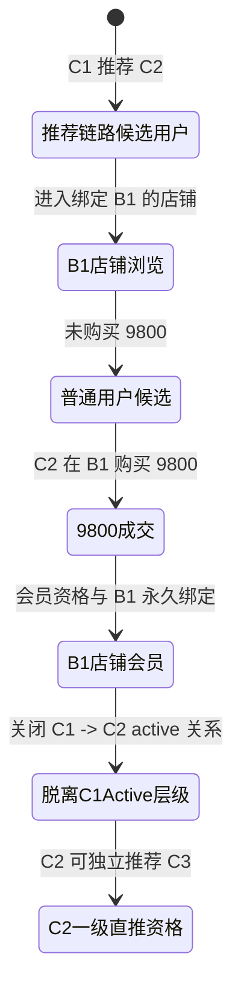

> [!CAUTION]
> **状态：Superseded**
>
> 本文档已被“总部统一商城 + 永久商家归属 + 独立会员 + 独立业务套餐 + 循环三三制”方案取代，不得继续作为代码开发依据。最新产品依据为 [YFTH_RELEASE_SCOPE_HQ_MALL_MEMBERSHIP_REFERRAL.md](YFTH_RELEASE_SCOPE_HQ_MALL_MEMBERSHIP_REFERRAL.md)。本文件仅保留用于历史追踪；其中 B 商家独立商城、单轮三人、在线 `9800` 套餐等口径均已失效。

# YFTH 9800 Release Scope - Direct Referral, Store Binding And City Partner

> 文档状态：`9800 Direct Referral Release Scope - Frozen Draft`
>
> 中文说明：范围口径已冻结，但参数和状态门禁仍待开发前由项目主控确认。本文件不是“已允许代码开发”的结论，也不是最终上线方案已完全定稿。

## 1. 本轮上线目标

本文件是御方通和“尽快上线版”的需求冻结基线，不是完整 ERP、自动结算或资金系统设计。后续开发必须以本文件、项目主控确认和后续只读架构复核结果为依据。

本轮上线优先形成以下闭环：

- C 端 `9800` 家庭康养套餐成交与会员资格。
- C 端永久绑定 B 商家店铺，以及绑定店铺商城展示。
- C 端一级直推应返台账与 B 商家线下结算凭证。
- B 商家总部进货、库存、C 端发货和自提的最小闭环。
- 城市合伙人招商范围、B 商家绑定及补货收益台账。

本轮不追求完整 ERP，不做复杂自动结算、自动打款或总部统一归集门店零售款后的人工分账。不得破坏 CRMEB 原商城、订单、支付、退款、页面装修、商品和库存基础能力。

## 2. 价格口径调整

- C 端家庭康养套餐统一口径为 `9800`。
- B 端标准加盟店统一口径为 `98000`。
- 历史代码和文档中的 `5980` / `59800` 口径，后续须按专项改造计划统一迁移至 `9800` / `98000`。
- 价格口径影响套餐模板、SKU 绑定、支付金额校验、成交快照、协议文案、推荐奖励计算、后台统计和测试脚本。
- 本文档只冻结需求和改造范围，不在本轮修改任何价格、订单、支付、套餐或测试代码。

`9800` 是本文件中一级直推奖励的固定计算基数；优惠、折扣、退款、风控和实际结算例外必须在后续规则版本中单独记录，不能由前端或人工备注隐式解释。

## 3. 角色重新定义

### 3.1 C 端用户 / 顾客 / 店铺会员

- 普通 C 端用户可以浏览和购买。
- 只有购买并开通 `9800` 店铺会员后，才拥有直推资格；未开通会员者没有直推资格。
- C 端用户购买 `9800` 后成为某个 B 商家的店铺会员，并永久绑定该 B 商家。
- C 端用户打开小程序时，应优先看到其绑定 B 商家的商店页面；公开品牌内容仍可按产品设计提供入口。

### 3.2 B 端商家 / 门店商家

- B 商家是实际销售、收款、发货、自提、客户维护和返现线下处理主体。
- B 商家可从总部进货、查看总部供货价、管理库存、处理 C 端发货/自提、查看绑定客户、核销，以及配置商户账号和收款方式。
- B 商家不是城市合伙人；两类角色、数据范围、收益来源和权限必须独立建模。

### 3.3 城市合伙人 / 招商合伙人

- 城市合伙人负责招商和寻找 B 端加盟客户，不承担普通 B 商家零售经营主体职责。
- 城市合伙人分为省区负责人、市区负责人、县区负责人三级。
- B 商家签约后绑定到对应城市合伙人；城市合伙人只能查看自身区域范围内 B 商家的补货数据和收益台账。
- B 商家倒闭、停业或终止时，负责该 B 商家的城市合伙人可在最小必要、脱敏优先的范围内查看相关 C 端客户，用于线下沟通处理。

## 4. C 端商店绑定规则

### 4.1 购买 `9800` 后永久绑定 B 商家

```text
C1 在 B1 商家购买 9800
  -> C1 成为 B1 店铺会员
  -> C1 永久绑定 B1
  -> C1 打开小程序优先进入 B1 商店页面
  -> C1 获得一级直推资格
```

### 4.1.1 店铺会员绑定生命周期

“永久绑定”是正常经营期间的业务约束，不是覆盖历史记录的单行字段：

- 用户不能主动解绑、换店或切换到其他 B 商家商城。
- B 商家不得私自把会员转给其他门店；总部普通运营人员不得在无审计的情况下手动改绑。
- B 商家闭店、停业或合同终止时，必须由总部受控且留痕的动作关闭 C 用户与该 B 商家的 active 绑定。
- 关闭绑定后，历史绑定记录保留且不物理删除；原订单、权益、推荐、核销、发货和返现台账继续指向历史 B 商家。
- C 用户的 active 店铺会员身份降级为普通用户，并显示“店铺已停止服务”。
- 用户之后可以在其他 B 商家重新购买 `9800`，并创建新的 active 店铺会员绑定；新绑定不得覆盖旧历史绑定。
- 同一用户同一时刻只能存在一个 active 店铺会员绑定；后续实现必须用服务端状态校验和唯一约束保证这一点。

建议绑定状态：

- `active`
- `closed_by_store_terminated`
- `downgraded_to_normal_user`
- `historical_only`

关闭 active 绑定只能由总部受控动作完成，必须记录操作人、原因、时间、前后状态和审计。城市合伙人只能查看获授权的线下跟进数据，不得关闭或改绑会员。

### 4.2 被推荐人购买前

C1 推荐 C2，且 C2 尚未购买 `9800` 时：

- C2 处于 C1 的推荐链路下。
- C2 进入 B1 商店页面。
- C2 仍是普通用户，不是店铺会员，也没有直推资格。
- C2 的普通商品购买可为 C1 产生普通商品推荐台账，具体比例后续后台配置。

### 4.3 被推荐人购买后

C2 购买 `9800` 后：

- C2 成为 B1 店铺会员，永久绑定 B1，并获得自己的一级直推资格。
- C2 脱离 C1 的 active 推荐层级；C1 与 C2 不再具有持续“上下级”关系。
- C1 只保留推荐 C2 成功的一次历史推荐事件和对应奖励台账。
- C1 不拥有 C2 后续客户、推荐、普通消费或经营关系。
- C2 后续推荐 C3 时，C2 可获得 C3 的一级推荐奖励；C1 不获得 C3 的奖励。



历史推荐、成交、奖励、结算和冲正记录必须保留可追溯性；“脱离 active 层级”不得删除历史记录，也不得变成跨代奖励依据。

## 5. C 端一级直推 33 制

- 仅做一级直推；不做多级、团队收益、下线收益或间接奖励。
- 不接 CRMEB 分销佣金，不写 `user_spread`、`user_brokerage`、`user_bill` 或 `now_money`。
- 不做自动打款、C 端钱包余额或自动提现。

固定阶梯和计算基数如下：

| 有效 `9800` 新会员序号 | 比例 | 固定金额 |
| --- | ---: | ---: |
| 第 1 位 | 15% | 1470 |
| 第 2 位 | 25% | 2450 |
| 第 3 位 | 60% | 5880 |
| 合计 | 100% | 9800 |

### 5.1 9800 推荐奖励序号规则

- 每位开通 `9800` 店铺会员的 C 用户只有一轮、最多 3 个有效 `9800` 新会员奖励序号。
- 第 1 / 2 / 3 位有效新会员分别固定对应 15% / 1470、25% / 2450、60% / 5880。
- 第 4 位及以后可以保留推荐历史和客户来源，但第一版不生成 `9800` 套餐返现台账。
- 不默认循环 `3/3/3`，不自动开启新周期，也不自动进入多级、团队或下线收益；是否开启新周期必须另行需求确认和架构审核。

有效序号的占用时点冻结为：

1. 被推荐人完成线上购买 `9800`、线上核销并通过可配置的 7–15 天无退款观察期后，才占用最终有效序号。
2. 仅支付成功但未核销时为 `paid_pending_writeoff`，不占最终序号。
3. 已核销但观察期未结束时为 `written_off_observing`，不占最终序号。
4. 观察期通过后，后续实现必须在事务内锁定推荐人奖励计数，再分配第 1 / 2 / 3 序号。
5. 多个被推荐人并发转有效时，必须按确定性规则排序分配，例如观察期通过时间、业务 ID、创建时间；具体排序字段在开发设计中确定，但不得依赖请求到达顺序。

失效、冲正与补位规则冻结为：

- 未通过观察期，以及观察期内退款、异常、重复客户或风控命中的推荐，标记失效且不占最终序号。
- 已通过观察期并已分配序号后发生退款或异常，必须生成冲正记录。
- 已冲正的已分配序号第一版不释放、不补位、不重排；已确认的第 1 / 2 / 3 序号保持历史稳定。

建议台账状态：

- `candidate_bound`
- `paid_pending_writeoff`
- `written_off_observing`
- `effective_sequence_assigned`
- `pending_store_settlement`
- `settled_offline`
- `invalid`
- `reversed`

有效新会员必须同时满足：

- 被推荐人线上购买 `9800`。
- 被推荐人完成线上核销。
- 经过可配置的 7–15 天无退款观察期；具体天数不能写死。
- 未命中异常、退款、重复客户或风控失效条件。

观察期内的奖励只能是待观察台账，不能解释为可提现或已付款金额。退款、异常和重复客户命中时，必须失效或形成可追溯冲正记录。

## 6. C 端普通商品推荐台账

- 只有已开通 `9800` 店铺会员的 C 端用户才有直推资格。
- 未开通会员的 C 端用户不能推荐他人，也不能获得普通商品推荐台账。
- 有资格的 C 用户推荐普通用户购物时，可以产生普通商品推荐台账。
- 普通商品推荐比例尚未确定，必须由后台规则配置或规则版本预留，不能写死。
- 系统只记录台账、状态、观察期、凭证和结算结果。
- B 商家完成一次线下结算核销后，该笔台账的待结算/可结算金额归零，并标记为已结算；这不是 CRMEB 用户余额或钱包余额。

## 7. 返现 / 奖励结算方式

C 端 `9800` 推荐奖励和普通商品推荐奖励均采用“系统记账、B 商家线下处理”的方式：

- 系统记录应返金额、观察期、状态、核销、凭证、已结算和冲正。
- B 商家线下处理实际返现，并上传或登记必要结算凭证。
- C 端可查看待观察金额、待返现金额、已结算金额、已冲正金额及结算状态。
- B 端可查看推荐人与被推荐人、`9800` 购买和核销状态、观察期、应返金额、待返现状态、线下结算凭证和结算完成动作。

系统不做自动微信零钱、银行卡转账、公户转私户、钱包余额、用户提现按钮、CRMEB 佣金、CRMEB 分销或 CRMEB 用户余额。

### 7.1 B 商家返现线下结算权限

C 端推荐返现可由 B 商家线下处理，但系统内的结算确认必须受角色、门店和 token 边界共同约束。

允许结算确认的角色：

- B 商家负责人 `franchisee`。
- B 商家店长 `store_manager`。
- 具备明确权限的总部管理员。

默认不允许结算确认的角色：

- 普通店员 `store_staff`。
- 普通 C 端用户。
- 服务导师。
- 城市合伙人；除非后续另行冻结委托授权流程。
- 其他门店的任何角色。

路由和 token 边界：

- B 商家端必须走 user-token 门店工作台路由，服务端通过 `CurrentBusinessContextServices` 解析当前门店和角色。
- 服务端不得信任前端传入的 `store_id`、`role_code` 或 `operator_uid`。
- 总部后台必须走 admin-token 路由和后台 API 权限。
- B 商家端不得复用总部 settlement 接口，不得将总部结算 API 下放给门店端。

建议后续能力码：

- `store_referral_reward_read`
- `store_referral_reward_settle`
- `store_referral_reward_upload_voucher`

门店隔离和审计：

- B 商家只能查看和结算本店绑定 C 用户产生的台账；C 推荐链路归属 B1 时，B2 无权查询或结算。
- 查询和写入都必须使用服务端解析的 `current_store_id`；跨店访问必须拒绝并审计。
- 结算动作必须登记或上传线下凭证、金额、方式和备注，并记录操作人、角色、门店、时间、IP 和前后状态。
- 结算完成后，台账进入已结算，待结算/可结算金额归零；该归零仅限推荐台账，不写 CRMEB 用户余额。

## 8. B 商家倒闭 / 停业 / 终止处理

B1 倒闭、停业或合同终止后：

- B1 下全部 C 端店铺会员降为普通用户，并显示“店铺已停止服务”或“店铺已关闭”。
- 不自动转店、不自动退款、不自动迁移到其他门店。
- 历史订单、权益、推荐、核销、地址和发货记录继续保留。
- 用户如需重新成为店铺会员，必须在其他店铺重新购买 `9800`。
- 负责 B1 的城市合伙人可在必要范围内查看相关客户，以便线下跟进；默认脱敏，完整联系方式必须受明确业务授权和审计控制。

建议后续明确状态语义：

- `store_closed_customer_pending_followup`
- `store_closed_member_downgraded`

## 9. C 端地址与 B 端发货

- C 端用户维护收货地址，用于线上购买和月度礼品/商品配送。
- 地址要进入 B 端发货场景；客户详情默认脱敏，发货详情仅展示履约必要地址。
- 发货和订单/履约记录必须保存地址快照，用户后续修改地址不得改写历史履约事实。
- B 商家负责 C 端发货，可选择配送或自提。
- 第一版不接真实快递 API，允许 B 商家手填物流公司、物流单号和发货备注。

## 10. B 端上线版功能范围

上线版只保留必要能力：

- 总部进货、总部供货价和门店库存。
- C 端发货、自提和核销。
- 绑定 B 商家的商品/店铺页面。
- 客户列表、会员/普通顾客标识、地址和发货信息。
- 推荐返现台账查看、线下核销凭证和结算动作。
- 商户账号与收款方式配置。

暂不做或隐藏：复杂经营报表、复杂采购售后、自动分账、自动打款、复杂员工绩效、复杂库存盘点、产品额度自动抵扣、多级分销和区域团队分红。

## 11. B 商家库存与发货

- B 商家发货、自提和会员礼品领取必须以门店库存为前提。
- 门店库存来自总部进货/补货。
- C 端商品发货、自提和会员礼品领取后，需要扣减 B 商家库存，并记录库存流水、业务单据、操作人和时间。
- 第一版仅实现最小库存闭环，不扩大至复杂采购售后。
- 不得直接扣减 CRMEB 全局 SKU 库存，除非后续专项设计明确批准。
- 应优先复用已经完成的 YFTH 供应链与门店库存模块；现有供应链 V1 尚未实现 CRMEB 消费订单自动扣门店库存，后续必须补齐受控业务边界，不能直接改写旧链路。

## 12. B 商家收款配置

B 商家加盟成功后必须提供并受审核的配置：

- 商户账号和收款方式。
- 商户号或子商户号。
- 结算账户、收款主体、开票主体和退款主体。
- 状态：未配置、待审核、已启用、已停用、异常。

上线版原则：

- C 端消费者支付给实际 B 商家。
- 总部不统一收取全部 C 端零售款后再人工分账。
- B 商家向总部支付采购/补货款。
- B 商家向 C 端的返现在线下处理，系统只记录台账和凭证。

支付通道、主体一致性、退款责任和发票责任须在后续支付专项中单独确认；本文件不授权改造现有 CRMEB 支付流程。

## 13. 城市合伙人三级体系

城市合伙人是招商合伙人，不是普通 B 商家。

### 13.1 城市合伙人层级绑定

- B 商家只直接绑定一个负责招商的最低实际归属合伙人，不能同时直接绑定多个收益主体。
- 若由县区负责人招募，直接绑定县区负责人；无县区负责人时可直接绑定市区负责人；无市区负责人时可直接绑定省区负责人。
- 上级关系由城市合伙人树自动推导：县区负责人 -> 市区负责人 -> 省区负责人；市区负责人 -> 省区负责人；省区负责人为顶级。

```text
省区负责人
  -> 市区负责人
    -> 县区负责人
      -> B 端商家
```

- 省区负责人可查看本省区下所有市区、县区、B 商家、补货和收益数据。
- 市区负责人可查看本市区下所有县区、B 商家、补货和收益数据。
- 县区负责人可查看自身范围内 B 商家、补货和收益数据。
- B 商家签约后绑定到对应城市合伙人；补货数据进入其区域统计范围。
- B 商家倒闭后，对应城市合伙人可按最小必要信息原则查看该门店相关 C 端客户，用于线下沟通处理。

区域范围、跨区变更、代理终止、继任、客户信息查看授权和审计规则必须在开发前补齐，不能只靠前端筛选。

### 13.2 数据统计与收益归属

- 上级可逐级汇总查看下级及其 B 商家的补货数据，但数据统计权限不等于收益权限。
- 补货实付金额只生成一组城市合伙人收益事件。
- 是否由省区、市区、县区或仅直接招商人获得收益，以及各层级比例，必须由后台规则版本配置。
- 不写死省/市/县比例，不默认三层都拿钱，也不默认只有最低层拿钱。
- 同一补货订单、同一规则版本、同一城市合伙人、同一收益类型只能生成一条收益台账；后续实现必须使用唯一键或幂等键防重复。
- 退款、取消或售后必须产生冲正记录，不物理删除历史。

## 14. 城市合伙人补货收益台账

收益来源是 B 商家补货的实付金额，不使用销售额、毛利、商品原价或门店库存金额。收益比例暂未确定，必须配置化并保留规则版本，不能写死。

```text
B 商家补货支付成功
  -> 生成城市合伙人冻结收益
  -> 补货订单完成
  -> 完成后 1 天解冻为可结算
  -> 城市合伙人发起提现/结算申请
  -> 总部审核
  -> 总部线下结算并登记凭证
  -> 总部标记结算完成
  -> 城市合伙人前端显示结算成功
```

- 不做自动打款、钱包余额自动转账、CRMEB 佣金、CRMEB 分销、`now_money`、`user_brokerage` 或 `user_bill` 写入。
- 系统只做收益台账、冻结、解冻、结算申请、审核、线下结算凭证和完成状态。
- “完成后 1 天”应实现为可配置观察/解冻规则，后续需明确时区、退款/售后冲正和补货取消边界。

## 15. 已完成能力如何复用

### 可直接复用

- YFTH 业务基础域、统一审计和幂等。
- 多身份壳层和门店工作台入口。
- 门店客户 CRM 基础、服务核销和动态码能力。
- 总部供应链与门店采购库存基础。
- 总部后台产品化能力。

### 需要改造

- `5980` 套餐权益改为 `9800` 价格口径和会员资格。
- 推荐关系与只读奖励台账改为 `9800` 一级直推和 B 商家线下结算。
- 月度权益履约改为 B 商家发货、自提和门店库存扣减。
- B 端工作台按上线版精简。
- 加盟流程区分 B 商家与城市合伙人。
- 产品额度暂隐藏或保留为后续模块，不自动抵扣。

### 暂不开放

- 自动打款、C 端提现、多级分销、复杂区域分红。
- 产品额度自动抵扣、复杂采购售后、真实快递 API、自动供应链库存联动高级版。
- 电子合同/线上签约、加盟费线上支付、服务评价、自动爽约和高级权益反冲恢复。

## 16. 后续推荐开发顺序

1. 价格口径统一：`9800` / `98000`。
2. C 端店铺绑定与会员资格重构。
3. C 端一级直推与应返台账。
4. B 商家线下结算/核销凭证。
5. C 端地址与 B 端发货、自提、库存扣减。
6. B 端收款配置。
7. 城市合伙人三级体系。
8. 城市合伙人补货收益台账。
9. 上线前全链路盘点、合规审查和生产部署准备。

每一步进入开发前均须重新确认数据归属、权限、状态机、审计、幂等、退款/冲正和 CRMEB 边界；第 1 至第 5 步形成最小 C/B 成交履约闭环后，再进入城市合伙人收益模块。

## 17. 风险与边界

- 不能做多级分销、团队收益、下线收益、自动返现或公户对私户自动转账。
- 不能将奖励写入 CRMEB 余额、佣金、积分、分销或提现字段。
- B 商家和城市合伙人必须是独立角色、权限和收益域。
- 未开通 `9800` 店铺会员的 C 用户不得拥有直推资格。
- C 用户开通 `9800` 后必须脱离此前直推人的 active 层级，同时保留历史事件和台账。
- 店铺倒闭后不得自动转店；会员降级为普通用户并显示提示。
- 城市合伙人只可在必要范围内查看客户，尤其是倒闭门店跟进场景必须脱敏、授权和审计。
- 不得让 C 端零售收款、B 商家采购款、奖励应返台账和城市合伙人收益台账混为一个余额或结算对象。
- 价格、推荐比例、观察期、普通商品比例、补货收益比例、区域范围和支付主体均是后续开发前必须由项目主控确认的冻结参数。

## 当前待确认事项

- `5980` / `59800` 历史订单、已激活套餐、协议与退款记录的迁移和兼容策略。
- B 商家销售收款的真实支付通道、商户主体、退款主体和开票责任。
- 7–15 天观察期的具体天数，以及“线上核销”对 `9800` 推荐奖励生效的确切业务事件。
- 普通商品推荐比例。
- 省/市/县补货收益比例，以及上级是只看数据还是也获得收益。
- B 商家返现线下结算凭证标准。
- B 商家倒闭后客户完整联系方式的查看授权主体、期限和撤销机制。
- 城市合伙人区域编码、层级变更、继任和跨区数据治理。
- 原始 B 端“新店直推 20% / 30% / 50% 产品抵返”政策是否纳入本上线版；本文件未将其自动纳入城市合伙人补货收益模型。
